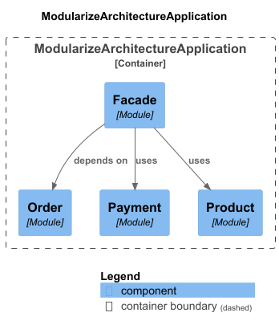

# Modularization Architecture - (Monolithic)

## Overview

This modular software architecture is designed to structure large **monolithic applications** in a more maintainable and scalable way. It emphasizes the **separation of concerns** by isolating business domains into well-defined modules. Each module encapsulates its domain logic, service implementation, and communication interface (SPI), promoting **clear boundaries** and **low coupling** between components.

## Principles of Modularization

The core principles behind modularization in a monolithic architecture include:

- **Encapsulation of Domain Logic**: Each business unit (e.g., payment, product) owns its domain model and service logic.
- **Clear Interfaces (SPIs)**: Modules expose service interfaces (SPIs) that can be consumed by other modules without direct dependency on internal implementations.
- **Facilitated Testing and Deployment**: Although deployed together, modules can be developed and tested independently.

## Difference Between Modularization and Microservices

A **Modularized Monolith** organizes features into distinct modules within a single deployable unit, where communication happens internally through interfaces. This approach simplifies development, testing, and deployment while maintaining clear boundaries between business domains, making it ideal for teams seeking structure without the operational burden of distributed systems.

**Microservices**, on the other hand, decompose the application into multiple independently deployable services that communicate over the network. While this architecture allows for greater scalability, team autonomy, and flexibility in technology choices, it also introduces increased complexity in areas like infrastructure, monitoring, service coordination, and data consistency.

## When to Use a Modular Monolithic Architecture

A modular monolithic architecture is best when:

- You want the maintainability of modular code without the infrastructure complexity of microservices.
- Your application doesn't require independent deployment of components.
- You're preparing for a possible future migration to microservices.
- Your team prefers simplicity in testing, debugging, and deployment.

## Possibility to Expand to Vertical Architecture

This architecture can evolve into a **vertical slice** model, where each module becomes a self-contained feature unit encompassing its domain, service logic, and persistence. This evolution prepares the system for future migration to microservices without major refactoring, supporting gradual scaling and organizational growth.

## Project Structure

### Project Summary

This project follows a modular package structure, separating each business domain (`payment`, `product`) into isolated modules with a clear internal organization:

- `domain` contains core domain entities.
- `spi` exposes service interfaces for module interaction.
- `service` holds the implementation of business logic.
- Each module has a `package-info.java` annotation to mark it as an `ApplicationModule` and to define the `NameInterface`.

A centralized **Facade** coordinates communication between modules, ensuring a clean and loosely coupled system design.

```
com.thedevhorse.modularizearchitecture
│
├── payment
│   ├── domain
│   │   ├── package-info.java (NameInterface)
│   │   └── Payment.java
│   ├── service
│   │   └── PaymentServiceImpl.java
│   ├── spi
│   │   ├── PaymentService.java
│   │   └── package-info.java (NameInterface)
│   └── package-info.java (ApplicationModule)
│
├── product
│   ├── domain
│   │   ├── package-info.java (NameInterface)
│   │   └── Product.java
│   ├── service
│   │   └── ProductSpiServiceImpl.java
│   ├── spi
│   │   ├── ProductService.java
│   │   └── package-info.java (NameInterface)
│   └── package-info.java (ApplicationModule)
```

## C4 Diagram



This diagram should visualize module dependencies, showing how each domain interacts through SPI layers and how the facade orchestrates communication across the system.

## Conclusion

A **modular monolithic architecture** provides a strong foundation for building enterprise-grade applications with long-term maintainability in mind. It enables clean separation of business logic, promotes testability, and simplifies development workflows. It’s especially well-suited for teams aiming to build scalable applications without incurring the complexity of microservices from day one—while still leaving the door open for future evolution.
